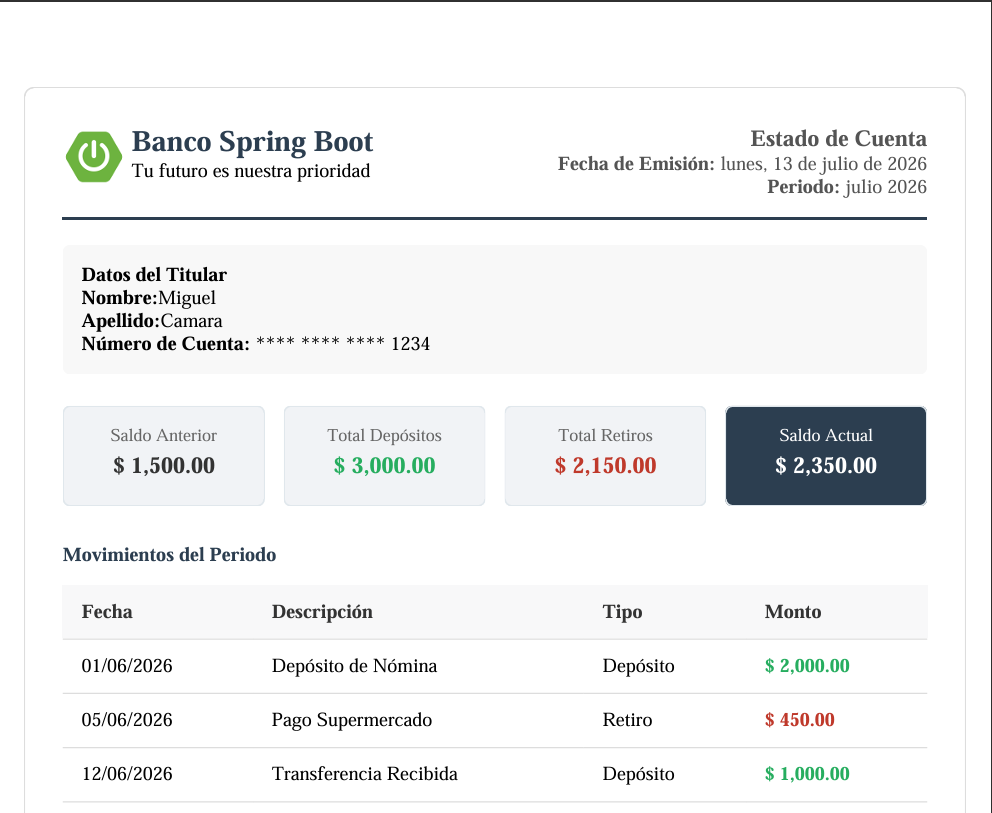

# PDF GENERATE

<p align="center">
   &nbsp;
  &nbsp;
</p>

## Run Locally

Clone the project

```bash
  git clone <repo>
```

Go to the project directory

```bash
  cd <repo>
```

Run Project

```bash
  ./mvnw spring-boot:run
```

## Screenshots



## API Reference

#### GET

```http
  GET /pdf
```

| Parameter | Type | Description                      |
| :-------- | :--- | :------------------------------- |
|           |      | Retorna el archivo pdf en byte[] |
